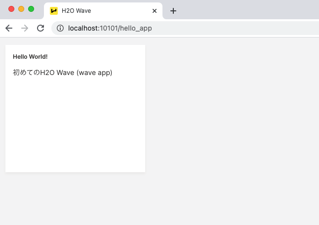
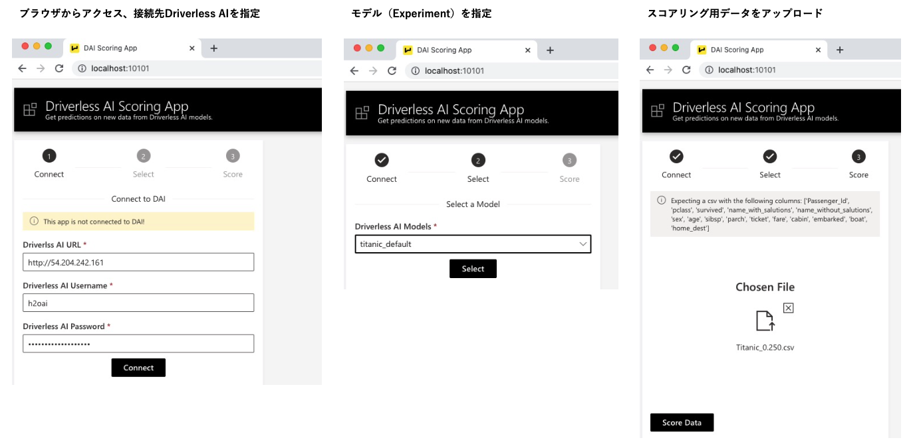
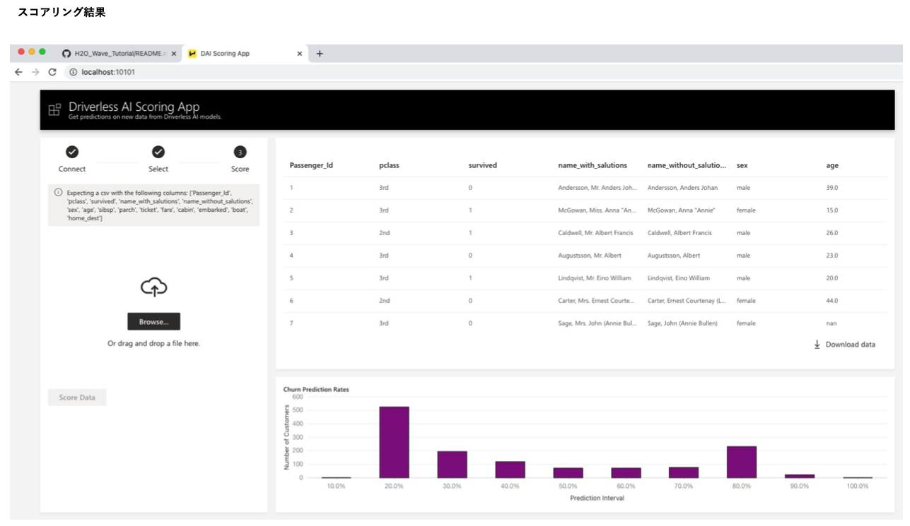

# H2O_Wave_Tutorial

## H2O Waveチュートリアル
目的：
- Batch Scoring App（H2O Driverless AIに接続、利用学習済みモデルを選択、csvのアップロードとスコアリングの実施）の開発
  
内容：
- Waveの基本的要素に関して
- Batch Scoring Appの各要素のデモアプリ

***
### 実行方法
#### フォルダ構成
```
Wave_Tutorial_v<Waveバージョン>
 ├── requirements.txt  ... Python実行環境へインストールするライブラリ
 ├── demo_app/         ... Batch Scoring Appの各要素のデモアプリ
 ├── app.py            ... Batch Scoring App
 ├── sample_data/      ... サンプルデータ
 └── scoring_data/     ... Batch Scoring Appのスコアリングデータ保存先（Batch Scoring App実行の際scoring_dataとしてディレクトリを作成しておく）
```
#### アプリの実行（Mac OS環境）

Waveの起動（Webサーバの実行）
1. [Wave SDK](https://github.com/h2oai/wave/releases)のダウンロード
2. ダウンロードフォルダを解凍し、フォルダ内でwavedファイルを実行
```
wave-0.16.0-darwin-amd64 % ./waved
2021/06/01 08:33:00 # 
2021/06/01 08:33:00 # ┌────────────────┐ H2O Wave 
2021/06/01 08:33:00 # │  ┐┌┐┐┌─┐┌ ┌┌─┐ │ 0.16.0 20210525010626
2021/06/01 08:33:00 # │  └┘└┘└─└└─┘└── │ © 2021 H2O.ai, Inc.
2021/06/01 08:33:00 # └────────────────┘
...
```
  
Python実行環境の準備と各アプリの実行（チュートリアルフォルダ内で実行）
```bash
Wave_Tutorial_v0160 % source v0160/bin/activate                                   (1)
(v0160) Wave_Tutorial_v0160 % python -V
Python 3.8.10
(v0160) Wave_Tutorial_v0160 % pip install -r requirements.txt                     (2)
(v0160) Wave_Tutorial_v0160 % wave run demo_apps/demo_hello_app.py                (3)
...
```
1. (1) Python仮想環境のアクティベート（'v0160'としてチュートリアルフォルダ内で環境作成済み）  
2. (2) 必要Pythonパッケージのインストール（初回のみ実施）  
3. (3) アプリの実行  
4. (3)の実行後、ブラウザからアクセス  


***
## Batch Scoring App
#### アプリの起動
```bash
(v0160) Wave_Tutorial_v0160 % wave run app.py
```
#### アプリの利用



***
[PDF資料](./Wave-GettingStarted_ver20210605.pdf)
***
### チュートリアルバージョン
Wave0.16.0:[Wave_Tutorial_v0160](Wave_Tutorial_v0160/)

***
### [H2O Wave 公式ページ](https://wave.h2o.ai/)
